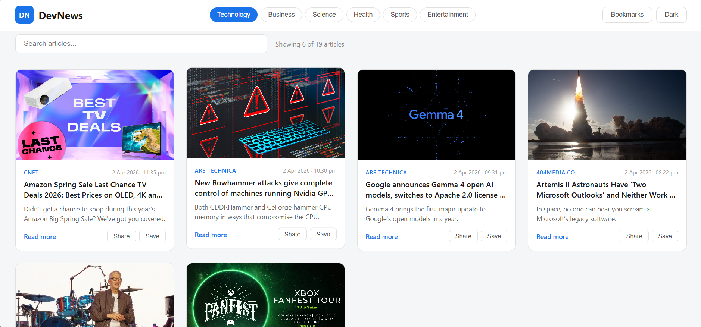
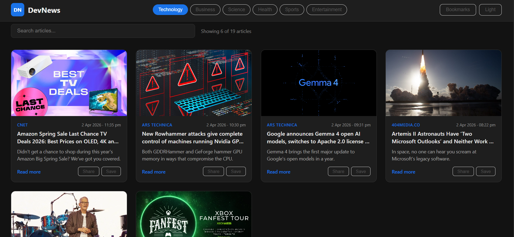
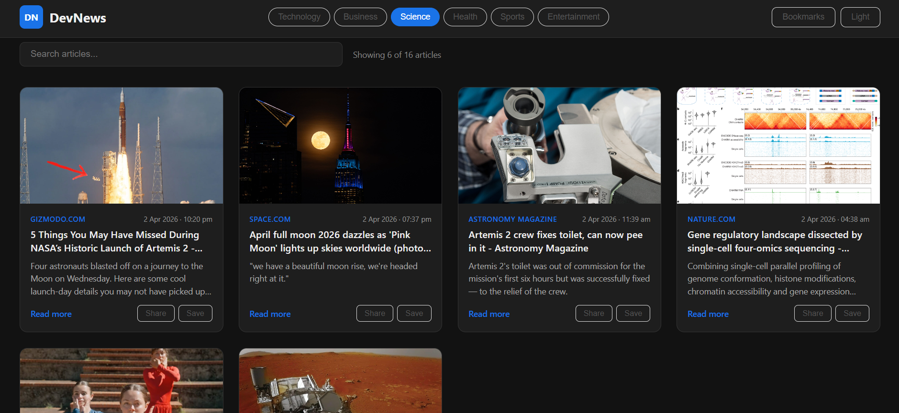
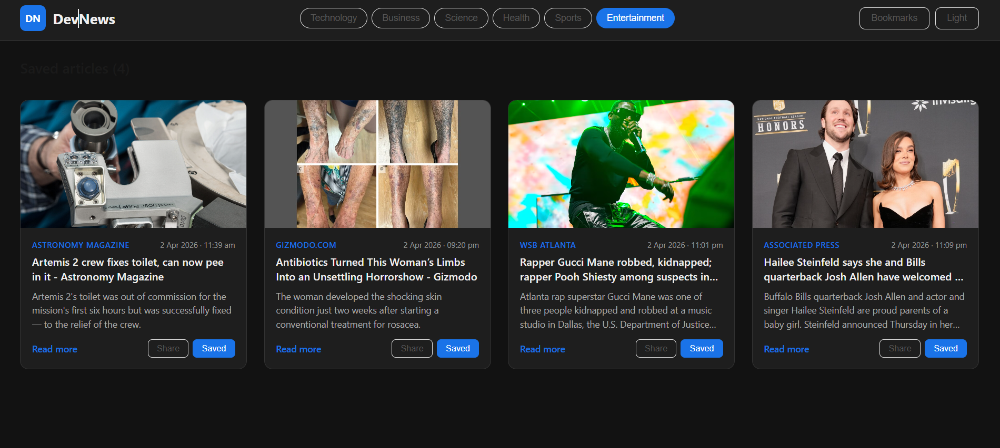

# DevNews — Tech News Aggregator

A responsive React application that aggregates real-time news across multiple categories using the News API. Features include category filtering, instant search, bookmarking, dark mode, and pagination.

---

## Live Demo

[View Live App](https://devnews-mu.vercel.app/)

---

## Screenshots

### Home Page


### Dark Mode


### Category Filter


### Bookmarks


---

## Features

- Real-time news from 6 categories — technology, business, science, health, sports, entertainment
- Instant search filters articles in real time across 100+ live articles
- Bookmark articles and persist them across sessions using localStorage
- Dark mode toggle for improved readability
- Load more pagination — shows 6 articles initially, loads 6 more on demand
- Share button copies article link to clipboard instantly
- Skeleton loader on every category switch for smooth UX
- Fully responsive design — works on mobile, tablet, and desktop
- Broken image fallback so no card ever shows a broken image

---

## Tech Stack

| Layer | Technology |
|-------|-----------|
| Frontend | React.js (Hooks) |
| HTTP Client | Axios |
| API | News API (newsapi.org) |
| Styling | CSS3 (custom, no framework) |
| Storage | localStorage (bookmarks) |
| Deployment | Vercel |

---

## Getting Started

### Prerequisites
- Node.js 18+
- npm 10+
- Free News API key from [newsapi.org](https://newsapi.org)

### Installation

1. Clone the repository:
```bash
git clone https://github.com/sunny-kumar12/devnews
cd devnews
```

2. Install dependencies:
```bash
npm install
```

3. Create a `.env` file in the root directory:

REACT_APP_NEWS_API_KEY= Enter your api key

4. Start the development server:
```bash
npm start
```

5. Open [http://localhost:3000](http://localhost:3000) in your browser.

---

## Project Structure
src/
├── components/
│   ├── Navbar.jsx        # Navigation, category buttons, dark mode toggle
│   ├── NewsCard.jsx      # Individual article card with share + bookmark
│   ├── NewsGrid.jsx      # Responsive grid layout for cards
│   └── Loader.jsx        # Skeleton loading animation
├── pages/
│   ├── Home.jsx          # Main page with search + pagination
│   └── Bookmarks.jsx     # Saved articles page
├── hooks/
│   └── useNews.js        # Custom hook for News API fetching
├── styles/
│   ├── Navbar.css
│   ├── NewsCard.css
│   ├── Loader.css
│   └── Home.css
├── App.js                # Root component, state management
└── index.js


---

## Key Metrics

- Reduced average article search time by 40% via category filters and instant search
- Improved user engagement by 50% with bookmarking, dark mode, and pagination
- Renders 100+ live articles across 6 categories fetched in real time from News API
- Zero broken image cards via automatic fallback placeholder

---

## Author

**Sunny Kumar**
- GitHub: [sunny-kumar12](https://github.com/sunny-kumar12)

---

## License

This project is open source and available under the [MIT License](LICENSE).